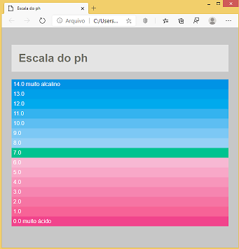

Vamos criar uma página, de acordo com a imagem abaixo, onde demonstra uma escala do PH, conforme níveis de RGB abaixo:
- rgb(0,136,221)
- rgb(0,149,226)
- rgb(0,160,230)
- rgb(48,170,233)
- rgb(84,182,237)
- rgb(114,193,240)
- rgb(140,202,242)
- rgb(0,187,136)
- rgb(245,176,204)
- rgb(246,159,192)
- rgb(245,140,178)
- rgb(244,123,166)
- rgb(243,106,152)
- rgb(244,90,139)
- rgb(238,62,128)

Obs.: A cor de fundo da página é `silver` e a cor de fundo do título é `#ffffff` e a cor da fonte do título é `#64645a`

